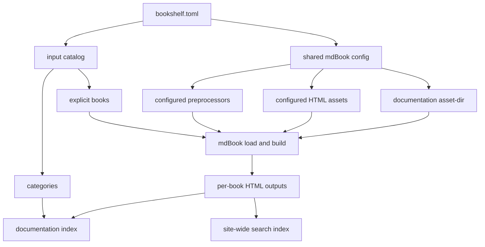

# Contributing

This document explains how the project is implemented today and what constraints
should stay true when changing it.

## Core Direction

`mdbook-bookshelf` is mdBook-first.

That means:

- keep stock mdBook responsible for single-book loading and HTML rendering
- keep `bookshelf.toml` close to stock mdBook config
- add documentation portal behavior around mdBook instead of replacing it
- prefer source-derived routing and authoring rules over hidden output aliases

## Build Pipeline

At a high level the build works like this:

1. load `bookshelf.toml`
2. build an input catalog from explicit books and categories
3. load each book's canonical `SUMMARY.md`
4. generate stable documentation runtime assets under `[bookshelf].asset-dir`
5. inject per-page documentation runtime metadata with an mdBook preprocessor
6. build each book with mdBook's HTML renderer into its canonical output root
7. write the generated site-root documentation index
8. merge per-book search indexes into one shared site-wide search index

The serve path builds first, then serves the output directory as static files.



## Code Map

- `cli/mdbook-bookshelf/src/` contains the `book build` and `book serve` CLI
- `crates/mdbook-bookshelf/src/config.rs` parses and validates
  `bookshelf.toml`
- `catalog.rs` builds the canonical book catalog and output roots
- `build.rs` orchestrates the full site build
- `documentation_index.rs` writes the generated site-root documentation index
- `documentation_ui.rs` writes the runtime assets for the return button and
  search override, and injects page metadata
- `search.rs` composes the shared search index and localized wrappers
- `serve.rs` builds and serves the generated site
- `tests/` holds config, navigation, build, and serve coverage

## Guardrails

Changes should preserve these properties:

- `bookshelf.toml` stays the single human-owned site config
- each explicit book keeps its own canonical `SUMMARY.md`
- every book appears in exactly one configured category
- the site-root documentation index stays generated
- authored page routes stay source-derived
- duplicate and overlapping canonical output roots stay invalid
- sidebars and previous/next stay scoped to the active book
- generated documentation runtime source assets stay under
  `[bookshelf].asset-dir`

Current reserved behavior that matters during implementation:

- legacy `root-id` is rejected
- authors should not need merged summaries or duplicated navigation trees

## Working With Stock mdBook

The implementation intentionally leans on stock mdBook concepts:

- stock `Config`
- mdBook book configuration fields for book rendering
- stock summary parsing
- stock HTML output per book
- stock search UI, with a documentation-specific shared index override

When possible, extend this model instead of inventing parallel authoring
systems.

This project should not absorb unrelated mdBook extensions. Features such as
Mermaid diagrams belong in standalone preprocessors like `mdbook-mermaid`, then
`mdbook-bookshelf` can run those preprocessors through normal mdBook
configuration.

## Verification

Install the external tools used by the integration checks:

```bash
cargo install mdbook-variables mdbook-mermaid
```

Run the full test suite:

```bash
cargo test --locked
```

Useful spot checks:

```bash
cargo run --bin book -- build bookshelf.toml --dest-dir .tmp/project-docs-site
cargo run --bin book -- build examples/self-contained/bookshelf.toml --dest-dir .tmp/bookshelf-site
cargo run --bin book -- build tests/fixtures/build-cli/repo-scale/bookshelf.toml --dest-dir .tmp/repo-scale-site
```
