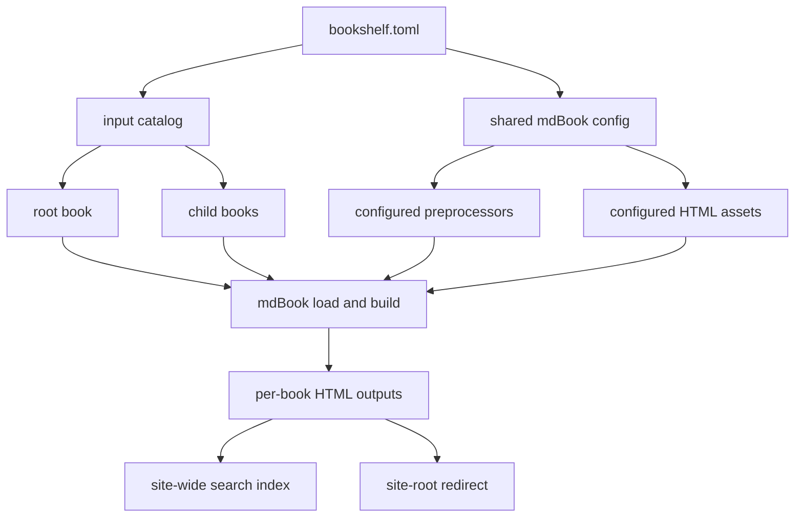

# Contributing

This document explains how the project is implemented today and what constraints
should stay true when changing it.

## Core Direction

`mdbook-bookshelf` is mdBook-first.

That means:

- keep stock mdBook responsible for single-book loading and HTML rendering
- keep `bookshelf.toml` close to stock mdBook config
- add bookshelf behavior around mdBook instead of replacing it
- prefer source-derived routing and authoring rules over hidden output aliases

## Build Pipeline

At a high level the build works like this:

1. load `bookshelf.toml`
2. build an input catalog from the root book and child books
3. load each book's canonical `SUMMARY.md`
4. inject the synthetic root `Bookshelf` page into the root book
5. stage temporary UI assets for the header return button, breadcrumbs, and
   search override
6. build each book with mdBook's HTML renderer into its canonical output root
7. merge per-book search indexes into one shared site-wide search index
8. write the site-root redirect to the configured entry page

The serve path builds first, then serves the output directory as static files.



## Code Map

- `cli/mdbook-bookshelf/src/` contains the `book build` and `book serve` CLI
- `crates/mdbook-bookshelf/src/config.rs` parses and validates
  `bookshelf.toml`
- `catalog.rs` builds the canonical book catalog and output roots
- `build.rs` orchestrates the full site build
- `root_bookshelf_preprocessor.rs` injects the synthetic root `Bookshelf` page
- `bookshelf_ui.rs` stages the runtime UI assets for return button,
  breadcrumbs, and search override
- `search.rs` composes the shared search index and localized wrappers
- `serve.rs` builds and serves the generated site
- `tests/` holds config, navigation, build, and serve coverage

## Guardrails

Changes should preserve these properties:

- `bookshelf.toml` stays the single human-owned site config
- the root `[book]` remains the root book
- each child book keeps its own canonical `SUMMARY.md`
- the `Bookshelf` page stays synthetic
- authored page routes stay source-derived
- duplicate and overlapping canonical output roots stay invalid
- sidebars, breadcrumbs, and previous/next stay scoped to the active book

Current reserved behavior that matters during implementation:

- authored `bookshelf.md` paths are rejected
- legacy `root-id` is rejected
- authors should not need merged summaries or duplicated navigation trees

## Working With Stock mdBook

The implementation intentionally leans on stock mdBook concepts:

- stock `Config`
- stock `BookConfig`
- stock summary parsing
- stock HTML output per book
- stock search UI, with a bookshelf-specific shared index override

When possible, extend this model instead of inventing parallel authoring
systems.

## Verification

Run the full test suite:

```bash
cargo test
```

Useful spot checks:

```bash
cargo install mdbook-mermaid
cargo run --bin book -- build bookshelf.toml --dest-dir .tmp/project-docs-site
cargo run --bin book -- build examples/self-contained/bookshelf.toml --dest-dir .tmp/bookshelf-site
cargo run --bin book -- build tests/fixtures/build-cli/repo-scale/bookshelf.toml --dest-dir .tmp/repo-scale-site
```
